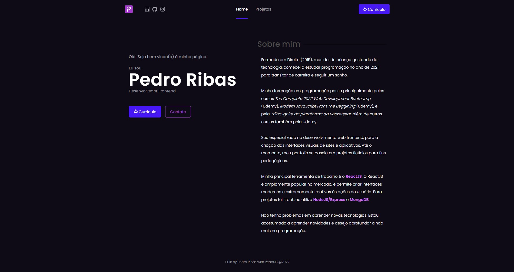
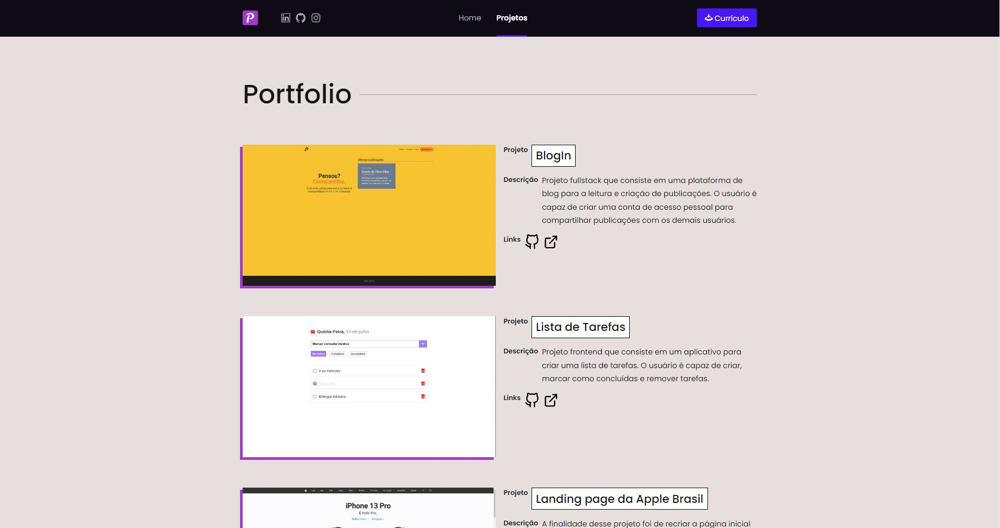
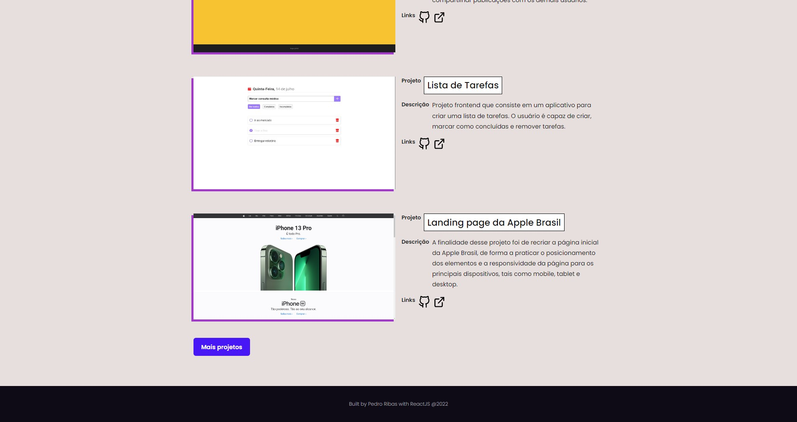

<h1 align="center">Meu Portfolio Pessoal</h1>

Webpage do meu portfolio pessoal.

## Introdução

Este é um projeto de portfolio frontend desenvolvido com com ReactJS.

## Screenshots

### Página Home

### Página Projects

## Pré-requisitos

Antes de começar, você vai precisar de [Git](https://git-scm.com), [Node.js](https://nodejs.org/en/) e um editor para o código, como [VSCode](https://code.visualstudio.com/).

## Tecnologias

- [ReactJs](https://pt-br.reactjs.org/)
- [React Router](https://reactrouter.com/)
- [SASS](https://sass-lang.com/)

## Autor

**Pedro Ribas**  

## Licença

Este projeto está sob licença [MIT](LICENSE).

Feito por <a href="https://github.com/pedroibribas" target="_blank">Pedro Ribas</a>.
